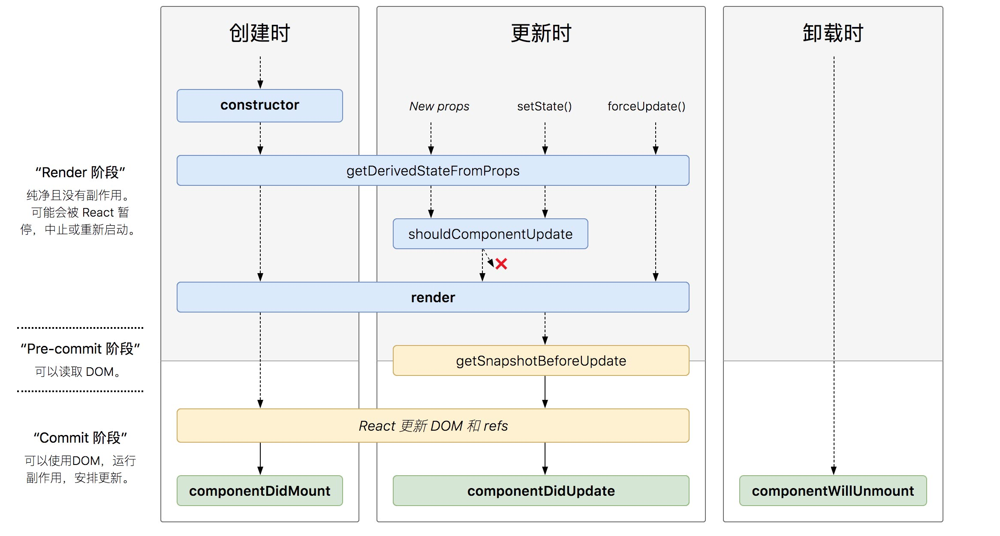

## 1. JSX 的执行过程

- 1. 我们在写代码的时候写成 JSX `<h1>hello, word</h1>`
- 2. 在打包的时候, 会调用 webpack 中的 babel-loader 把 JSX 写法转成 JS 写法(React.createElement("h1", {}, "hello, word"))
- 3. 在浏览器里执行 React.createElement, 得到虚拟 DOM, 也就是 React 元素, 他是一个普通的 JS 对象, 描述了界面上想看到的 DOM 元素的样式
- 4. 把 React 元素(虚拟 DOM)给了 ReactDOM.render, render 会把虚拟 DOM 转化成真实的 DOM, 插入到页面

> - 1. React 元素可能是字符串, 也可能是函数(函数组件), 也可能是一个类(类组件)
> - 2. 在定义组件元素的时候, 会把 JSX 所有的属性封装成 props 传递给组件
> - 3. 组件的名称首字母一定要大写, 因为 React 是根据首字母大小写区分是原生还是自定义组件
> - 4. 组件要先定义, 在使用
> - 5. 组件要返回且只能返回一个 React 元素, 返回多个需要用 React.Fragment 包起来

## 2. 函数组件的渲染过程

- 1. 定义一个 React 元素, 也就是虚拟 DOM, type == 组件构造函数
- 2. render 方法会执行构造函数, 并传入 props 返回虚拟 DOM
- 3. 把返回的虚拟 DOM 转成真实 DOM 插入到页面中去

## 3. 类组件的渲染过程

- 1. 定义一个类组件 React 元素
- 2. render 过程先创建类组件的实例 new Component(props), 并把 props 传进去
- 3. 调用组件实例的 render 方法的到 React 元素
- 4. 把返回的虚拟 DOM 转成真实 DOM 插入到页面中去

## 4. 状态

- 1. 属性是外部传入的, 不能修改, 类组件和函数组件都有属性
- 2. 状态是内部产生的, 可以修改, 状态只能在类组件
- 3. 唯一能给 this.state 赋值的地方就是构造函数, 只能附初始值, 其他地方要想改变状态造成组件更新, 只能调用 setState
- 4. 当调用 setState 方法的时候会引起组件的刷新, 组件会重新调用一次 render 方法, 得到新的虚拟 DOM, 进行 DOM-DIFF, 渲染差异
- 5. state 的更新可能是异步的, 可以接受一个函数, 第二个参数为回调函数, 多次属性合并更改后调用
- 6. 在事件处理函数或生命周期中是批量更新的
- 7. 在其他地方是同步更新

## 5. 事件

- 谨慎处理 this 问题:箭头函数(es7 首选方案), 匿名函数, bind

- event 事件对象, 并不是 DOM 原生的, 而是经过 React 封装的, 17 之前委托给 document 上, 之后委托给根节点(root)上

> 为什么需要合成事件(syntheticEvent)?
>
> - 1. 可以实现 state 状态的批量更新
> - 2. 可以实现事件对象的缓存和回收

## 6. Ref

- 1. Refs 提供了一种方式, 允许我们访问 DOM 节点或在 render 方法中创建的 React 元素
- 2. 在 React 渲染生命周期时, 表单元素的 value 将会覆盖 DOM 节点中的值, 在非受控组件中, 你经常希望 React 能赋予组件一个初始值, 但是不去控制后续的更新. 在这种情况下, 你可以指定一个 defaultValue, 而不是 value

### 6.1 ref 使用方式

- 1. 值是一个字符串`<div ref="a"></div`, this.refs.a = 此节点真实的 dom 元素

- 2. 值是通过`React.createRef`创建的对象,ref 接收底层 DOM 元素作为其 current 属性
  ```jsx
  class Sum extends React.component {
    constructor(props) {
      super(props)
      this.a = React.createRef()
    }
    render() {
      return <div ref={this.a} />
    }
  }
  ```
- 3. 当 ref 属性用于自定义 class 组件时, ref 对象接收组件的挂载实例作为其 current 属性
- 4. 当 ref 用于函数组件的时候,需要使用 forwardRef 进行转发给子组件, 因为他没有实例

## 7. 生命周期

### 7.1 旧版生命周期


### 7.2 新版生命周期

废弃了 componentWillMount componentWillReceiveProps componentWillUpdate 三个生命周期


## 8. Context(上下文)

- 在某些场景下，你想在整个组件树中传递数据，但却不想手动地在每一层传递属性。你可以直接在 React 中使用强大的 contextAPI 解决上述问题
- 在一个典型的 React 应用中，数据是通过 props 属性自上而下（由父及子）进行传递的，但这种做法对于某些类型的属性而言是极其繁琐的（例如：地区偏好，UI 主题），这些属性是应用程序中许多组件都需要的。Context 提供了一种在组件之间共享此类值的方式，而不必显式地通过组件树的逐层传递 props

```jsx
import React, { Component } from "react"
import ReactDOM from "react-dom"
let ThemeContext = React.createContext(null)
let root = document.querySelector("#root")
class Header extends Component {
  render() {
    return (
      <ThemeContext.Consumer>
        {value => (
          <div style={{ border: `5px solid ${value.color}`, padding: "5px" }}>
            header
            <Title />
          </div>
        )}
      </ThemeContext.Consumer>
    )
  }
}
class Title extends Component {
  render() {
    return (
      <ThemeContext.Consumer>
        {value => (
          <div style={{ border: `5px solid ${value.color}` }}>title</div>
        )}
      </ThemeContext.Consumer>
    )
  }
}
class Main extends Component {
  render() {
    return (
      <ThemeContext.Consumer>
        {value => (
          <div
            style={{
              border: `5px solid ${value.color}`,
              margin: "5px",
              padding: "5px"
            }}
          >
            main
            <Content />
          </div>
        )}
      </ThemeContext.Consumer>
    )
  }
}
class Content extends Component {
  render() {
    return (
      <ThemeContext.Consumer>
        {value => (
          <div style={{ border: `5px solid ${value.color}`, padding: "5px" }}>
            Content
            <button
              onClick={() => value.changeColor("red")}
              style={{ color: "red" }}
            >
              红色
            </button>
            <button
              onClick={() => value.changeColor("green")}
              style={{ color: "green" }}
            >
              绿色
            </button>
          </div>
        )}
      </ThemeContext.Consumer>
    )
  }
}

class Page extends Component {
  constructor(props) {
    super(props)
    this.state = { color: "red" }
  }
  changeColor = color => {
    this.setState({ color })
  }
  render() {
    let contextVal = { changeColor: this.changeColor, color: this.state.color }
    return (
      <ThemeContext.Provider value={contextVal}>
        <div
          style={{
            margin: "10px",
            border: `5px solid ${this.state.color}`,
            padding: "5px",
            width: 200
          }}
        >
          page
          <Header />
          <Main />
        </div>
      </ThemeContext.Provider>
    )
  }
}
ReactDOM.render(<Page />, root)
```
