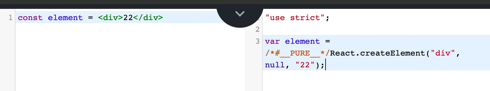

# React 基础

## 1. 什么是 React?

- React 是一个用于构建用户界面的 JavaScript 库, 核心专注于视图, 目的实现组件化开发

## 2. 组件化的概念

- 我们可以很直观的将一个复杂的页面分割成若干个独立的组件, 每个组件包含自己的逻辑的样式, 再将这些独立组件组合完成一个复杂的页面. 这样既减少了逻辑复杂度, 又实现了代码的复用

- - 可组合: 一个组件可以和其他的组建一起使用或则可以直接嵌套在另一个组件内部
- - 可重用: 每个组件都是具有独立功能的, 它可以被使用在多个场景中
- - 可维护: 每个小的组件仅仅包含自身的逻辑, 更容易被理解和维护
- - 属性变化 减少 dom diff

## 3. 搭建 React 开发环境

```shell
yarn global add create-react-app
create-react-app project-name
cd project-name
yarn start
```

- 默认会自动安装 React, 由两部分组成
- - react.js 是 React 的核心库 跟渲染无关
- - react-dom.js 是提供与 DOM 渲染相关的功能,内部比较重要的方法是 render , 它用来向浏览器插入 DOM 元素

## 4. JSX

### 4.1 什么是 JSX

- JSX 是一种 JS 和 HTML 混合的语法,将组件的结构、数据甚至样式都聚合在一起定义组件
- JSX 其实只是一种语法糖, 最终会通过 [babel](https://www.babeljs.cn/repl) 转译成 `createElement` 语法

  

### 4.2 什么是元素

- 元素是构成 React 应用的最小单位
- 元素用来描述你在屏幕看到的内容
- React 当中的元素事实上是普通的 JS 对象, ReactDOM 来确保浏览器中的 DOM 数据和 React 元素保持一致

```jsx
<h1 className="title" style={{ color: "red" }}>
  hello
</h1>
```

```javascript
React.createElement(
  "h1",
  {
    className: "title",
    style: {
      color: "red"
    }
  },
  "hello"
)
```

createElement 的结果

```json
{
  "type": "h1",
  "props": {
    "className": "title",
    "style": {
      "color": "red"
    }
  },
  "children": "hello"
}
```

### 4.3 JSX 表达式

- 可以任意地在 JSX 当中使用 JavaScript 表达式, 在 JSX 当中的表达式要包含在大括号里

```jsx
const title = "hello"
ReactDOM.render(<h1>{title}</h1>, document.getElementById("root"))
```

### 4.4 JSX 属性

- 需要注意的是 JSX 并不是 HTML, 在 JSX 中属性不能包含关键字, 像 class 需要写成 className, for 需要写成 htmlFor, 并且属性名需要采用小驼峰命名法

```jsx
ReactDOM.render(
  <h1 className="title" style={{ color: "red" }}>
    Hello
  </h1>,
  document.getElementById("root")
)
```

### 4.5 JSX 也是对象

- 可以在 if 或则 for 语句里使用 JSX
- 将它赋值给变量, 当做参数传入, 作为返回值使用

### 4.6 更新元素渲染

- React 元素都是 immutable 不可变的. 当元素被创建之后, 你是无法改变其内容或属性的. 一个元素就像是动画里的一帧, 它代表应用界面在某一时间点的样子
- 更新界面的唯一方法是创建一个新的元素, 然后将它传入 ReactDom.render()方法

```jsx
import React from "react"
import ReactDOM from "react-dom"
function tick() {
  const element = <div>{new Date().toLocaleTimeString()}</div>
  ReactDOM.render(element, document.getElementById("root"))
}
setInterval(tick, 1000)
```

### 4.7 React 只会更新必要的部分

- ReactDOM 首先会比较元素内容先后的不同, 而在渲染过程只会更新改变的部分
- 即便我们每秒都创建了一个描述整个 UI 树的新元素, ReactDOM 也只会更新渲染文本节点中发生变化的内容

## 5. 组件 & Props

- 可以将 UI 切分成一些独立的、可复用的部件, 这样就只需要专注于构建每个单独的部件
- 组件从概念上类似于 JavaScript 函数. 它接收任意的参数(props), 返回用于描述页面展示内容 React 元素

### 5.1 函数组件

- 函数组件接收一个单一的 props 对象并返回了一个 React 元素

```jsx
function Welcome(props) {
  return <h1>hello, {props.name}</h1>
}
```

### 5.2 类组件

```jsx
import React from "react"
class Welcome extends React.component {
  render() {
    return <h1>hello, {this.props.name}</h1>
  }
}
```

### 5.3 组件渲染

- React 元素不但可以是 DOM 标签, 还可以是用户自定义的组件
- 当 React 元素是用户自定义的组件时, 它会将 JSX 所接收的属性(attributes)转换为单个对象传递给组件,这个对象被称为 props
- 组件名必须以大写开头, 小写的被认为是 html 元素
- 组件必须在使用的时候定义或引用它
- 组件的返回值只能有一个根元素 或则 <><> or React.Fragment

### 5.4 复合组件&提取组件

- 组件由于嵌套的难以被修改, 可复用的部分也难以被复用, 所以可以吧大组件拆分成更小的组件
- 当你的 UI 中有一部分重复使用了好几次(Button Panel Avatar), 或者其自身就足够复杂(App), 类似这些都可以抽象成可复用组件的绝佳选择

```jsx
import React, { Component } from "react"
class Panel extends Component {
  render() {
    let { header, body } = this.props
    return (
      <div className="container">
        <div className="panel-default panel">
          <Header header={header}></Header>
          <Body body={body} />
        </div>
      </div>
    )
  }
}
class Body extends Component {
  render() {
    return <div className="panel-body">{this.props.body}</div>
  }
}
class Header extends Component {
  render() {
    return <div className="panel-heading">{this.props.header}</div>
  }
}
let data = { header: "标题", body: "内容" }
ReactDOM.render(<Panel {...data} />, root)
```

### 5.5 Props 的只读性

- 无论是使用函数或是类声明的组件, 他绝不能修改自己的 props
- `纯函数`没有改变它自己的输入值, 当传入的值相同时, 总是返回相同的结果
- 所有的 React 组件必须像`纯函数`那样使用它的 props

```javascript
// 纯函数
function sum(a, b) {
  return a + b
}
// 非纯函数
function withdraw(account, amount) {
  account.total -= amount
}
```

### 5.6 类型检查

- 要在组件的 props 上进行类型检查, 你只需要配置特定的 PropTypes 属性
- 可以通过配置特定的 defaultProps 属性来定义 props 默认值

```javascript
import PropTypes from "prop-types"

MyComponent.propTypes = {
  // 你可以将属性声明为 JS 原生类型，默认情况下
  // 这些属性都是可选的。
  optionalArray: PropTypes.array,
  optionalBool: PropTypes.bool,
  optionalFunc: PropTypes.func,
  optionalNumber: PropTypes.number,
  optionalObject: PropTypes.object,
  optionalString: PropTypes.string,
  optionalSymbol: PropTypes.symbol,

  // 任何可被渲染的元素（包括数字、字符串、元素或数组）
  // (或 Fragment) 也包含这些类型。
  optionalNode: PropTypes.node,

  // 一个 React 元素。
  optionalElement: PropTypes.element,

  // 你也可以声明 prop 为类的实例，这里使用
  // JS 的 instanceof 操作符。
  optionalMessage: PropTypes.instanceOf(Message),

  // 你可以让你的 prop 只能是特定的值，指定它为
  // 枚举类型。
  optionalEnum: PropTypes.oneOf(["News", "Photos"]),

  // 一个对象可以是几种类型中的任意一个类型
  optionalUnion: PropTypes.oneOfType([
    PropTypes.string,
    PropTypes.number,
    PropTypes.instanceOf(Message)
  ]),

  // 可以指定一个数组由某一类型的元素组成
  optionalArrayOf: PropTypes.arrayOf(PropTypes.number),

  // 可以指定一个对象由某一类型的值组成
  optionalObjectOf: PropTypes.objectOf(PropTypes.number),

  // 可以指定一个对象由特定的类型值组成
  optionalObjectWithShape: PropTypes.shape({
    color: PropTypes.string,
    fontSize: PropTypes.number
  }),

  // 你可以在任何 PropTypes 属性后面加上 `isRequired` ，确保
  // 这个 prop 没有被提供时，会打印警告信息。
  requiredFunc: PropTypes.func.isRequired,

  // 任意类型的数据
  requiredAny: PropTypes.any.isRequired,

  // 你可以指定一个自定义验证器。它在验证失败时应返回一个 Error 对象。
  // 请不要使用 `console.warn` 或抛出异常，因为这在 `onOfType` 中不会起作用。
  customProp: function(props, propName, componentName) {
    if (!/matchme/.test(props[propName])) {
      return new Error(
        "Invalid prop `" +
          propName +
          "` supplied to" +
          " `" +
          componentName +
          "`. Validation failed."
      )
    }
  },

  // 你也可以提供一个自定义的 `arrayOf` 或 `objectOf` 验证器。
  // 它应该在验证失败时返回一个 Error 对象。
  // 验证器将验证数组或对象中的每个值。验证器的前两个参数
  // 第一个是数组或对象本身
  // 第二个是他们当前的键。
  customArrayProp: PropTypes.arrayOf(function(
    propValue,
    key,
    componentName,
    location,
    propFullName
  ) {
    if (!/matchme/.test(propValue[key])) {
      return new Error(
        "Invalid prop `" +
          propFullName +
          "` supplied to" +
          " `" +
          componentName +
          "`. Validation failed."
      )
    }
  })
}
```

```jsx
import React from "react"
import ReactDOM from "react-dom"
import PropTypes from "prop-types"
class Person extends React.Component {
  static defaultProps = {
    name: "Stranger"
  }
  static propTypes = {
    name: PropTypes.string.isRequired,
    age: PropTypes.number.isRequired,
    gender: PropTypes.oneOf(["male", "female"]),
    hobby: PropTypes.array,
    position: PropTypes.shape({
      x: PropTypes.number,
      y: PropTypes.number
    }),
    age(props, propName, componentName) {
      let age = props[propName]
      if (age < 0 || age > 120) {
        return new Error(
          `Invalid Prop ${propName} supplied to ${componentName}`
        )
      }
    }
  }
  render() {
    let { name, age, gender, hobby, position } = this.props
    return (
      <table>
        <thead>
          <tr>
            <td>姓名</td>
            <td>年龄</td>
            <td>性别</td>
            <td>爱好</td>
            <td>位置</td>
          </tr>
        </thead>
        <tbody>
          <tr>
            <td>{name}</td>
            <td>{age}</td>
            <td>{gender}</td>
            <td>{hobby.join(",")}</td>
            <td>{position.x + " " + position.y}</td>
          </tr>
        </tbody>
      </table>
    )
  }
}
let person = {
  age: 100,
  gender: "male",
  hobby: ["basketball", "football"],
  position: { x: 10, y: 10 }
}
ReactDOM.render(<Person {...person} />, root)
```

## 6. 状态

- 组件的数据来源有两个地方, 分别是属性对象和状态对象
- 属性是父组件传递过来的(默认属性, 属性校验)
- 转台是自己内部的, 改变状态并刷新页面的唯一方式是 `setState`
- 属性和状态的变化都会影响视图更新

### 6.1 不要直接修改 state

- 构造函数是唯一可以给 this.state 赋值的地方

### 6.2 state 的更新可能是异步的

- 出于性能考虑, React 可能会把多个 setState 调用合并成一个调用
- 因为 this.props 和 this.state 可能会异步更新, 所以你不要依赖他们的值来更新下一个状态
- 可以让 setState 接受一个函数而不是一个对象. 这个函数用上一个 state 作为第一个参数

```jsx
import React from "react"
import ReactDOM from "react-dom"
class Counter extends React.Component {
  constructor(props) {
    super(props)
    this.state = {
      number: 0
    }
  }

  handleClick = () => {
    this.setState(state => ({ number: state.number + 1 }))
    this.setState(state => ({ number: state.number + 1 }))
  }
  render() {
    return (
      <div>
        <p> {this.state.number} </p>
        <button onClick={this.handleClick}>+</button>
      </div>
    )
  }
}

ReactDOM.render(<Counter />, document.getElementById("root"))
```

### 6.3 state 的更新会被合并

- 当你调用 setState 的时候, React 会把你提供的对象合并到当前的 state

```jsx
import React from "react"
import ReactDOM from "react-dom"
class Counter extends React.Component {
  constructor(props) {
    super(props)
    this.state = {
      name: "计数",
      number: 0
    }
  }
  handleClick = () => {
    this.setState(state => ({ number: state.number + 1 }))
    this.setState(state => ({ number: state.number + 1 }))
  }
  render() {
    return (
      <div>
        <p>
          {this.state.name}: {this.state.number}{" "}
        </p>
        <button onClick={this.handleClick}>+</button>
      </div>
    )
  }
}

ReactDOM.render(<Counter />, document.getElementById("root"))
```

### 6.4 数据是向下流动的

- 不管是父组件还是子组件都无法知道某个组件是有状态的还是无状态的, 并且也不关心它是函数组件还是类组件
- 这就是为什么称 state 为局部的或是封装的原因, 除了拥有并设置它的组件, 其他组件都无法访问
- 任何的 state 总是所属于特定的组件, 而且从该 state 派生的任何数据或 UI 只能影响树中 "低于" 它们的组件
- 如果你把一个以组件构成的树想象成一个 props 的数据瀑布的话, name 每个组件的 state 就像是在任意一点上给瀑布增加额外的水源, 但是它只能向下流动

```jsx
import React from "react"
import ReactDOM from "react-dom"
class Counter extends React.Component {
  constructor(props) {
    super(props)
    this.state = {
      name: "计数",
      number: 0
    }
  }
  handleClick = () => {
    this.setState(state => ({ number: state.number + 1 }))
  }
  render() {
    return (
      <div style={{ border: "1px solid red" }}>
        <p>
          {this.state.name}: {this.state.number}{" "}
        </p>
        <button onClick={this.handleClick}>+</button>
        <SubCounter number={this.state.number} />
      </div>
    )
  }
}
class SubCounter extends React.Component {
  render() {
    return (
      <div style={{ border: "1px solid blue" }}>
        子计数器:{this.props.number}
      </div>
    )
  }
}
ReactDOM.render(<Counter />, document.getElementById("root"))
```

## 7. 虚拟 DOM

### 7.1 index.js

```jsx
import React from "./react"
import ReactDOM from "./react-dom"
class Welcome extends React.Component {
  render() {
    return React.createElement("h1", { className: "title" }, this.props.title)
  }
}
let element = React.createElement(Welcome, { title: "标题" })
ReactDOM.render(element, document.getElementById("root"))
```

### 7.2 react.js

```js
import createElement from "./element"
class Component {
  static isReactComponent = true
  constructor(props) {
    this.props = props
  }
}
export default {
  createElement,
  Component
}
```

### 7.3 element.js

```js
const ReactElement = function(type, props) {
  const element = {
    type: type,
    props: props
  }
  return element
}

function createElement(type, config = {}, ...children) {
  const props = {}
  for (let key in config) {
    props[key] = config[key]
  }
  props.children = children
  return ReactElement(type, props)
}
export default createElement
```

### 7.4 react-dom.js

```js
function render(element, container) {
  if (typeof element == "string") {
    return container.appendChild(document.createTextNode(element))
  }
  let type, props
  type = element.type
  props = element.props
  if (type.isReactComponent) {
    //如果为true说明它是一个类组件
    element = new type(props).render()
    type = element.type
    props = element.props
  } else if (typeof type == "function") {
    element = type(props)
    type = element.type
    props = element.props
  }
  const domElement = document.createElement(type)
  for (let propName in props) {
    if (propName === "children") {
      let children = props[propName]
      children = Array.isArray(children) ? children : [children]
      children.forEach(child => render(child, domElement))
    } else if (propName === "className") {
      domElement.className = props[propName]
    } else if (propName === "style") {
      let styleObj = props[propName]
      let cssText = Object.keys(styleObj)
        .map(attr => {
          return `${attr.replace(/([A-Z])/g, function() {
            return "-" + arguments[1]
          })}:${styleObj[attr]}`
        })
        .join(";")
      domElement.style.cssText = cssText
    } else {
      domElement.setAttribute(propName, props[propName])
    }
  }
  container.appendChild(domElement)
}
export default { render }
```

## 8. 事件处理

- React 事件的命名采用小驼峰式(camelCase), 而不是纯小写
- 使用 JSX 语法时你需要传入一个函数作为事件处理函数, 而不是一个字符串
- 你不能通过返回 false 的方式来阻止默认行为. 你必须显式的使用 preventDefault

```jsx
import React from "react"
import ReactDOM from "react-dom"
class Link extends React.Component {
  handleClick(e) {
    e.preventDefault()
    console.log("The link was clicked.")
  }
  render() {
    return (
      <a href="http://www.baidu.com" onClick={this.handleClick}>
        Click me
      </a>
    )
  }
}

ReactDOM.render(<Link />, document.getElementById("root"))
```

### 8.1 this

- 必须谨慎对待 JSX 回调函数中的 this, 可以使用:
- - 公共函数(箭头函数)
- - 匿名函数
- - bind 绑定

```jsx
class LoggingButton extends React.Component {
  handleClick() {
    console.log("this is:", this)
  }
  handleClick1 = () => {
    console.log("this is:", this)
  }
  render() {
    //onClick={this.handleClick.bind(this)
    return <button onClick={event => this.handleClick(event)}>Click me</button>
  }
}
```

### 8.2 向事件处理程序传递参数

- 匿名函数
- bind

```jsx
class LoggingButton extends React.Component {
  handleClick1 = (id, event) => {
    console.log("id:", id)
  }
  render() {
    return (
      <>
        <button onClick={event => this.handleClick("1", event)}>
          Click me
        </button>
        <button onClick={this.handleClick.bind(this, "1")}>Click me</button>
      </>
    )
  }
}
```

### 8.3 Ref

- Refs 提供了一种方式, 允许我们访问 DOM 节点或在 render 方法中创建的 React 元素
- 在 React 渲染生命周期时, 表单元素的 value 将会覆盖 DOM 节点中的值, 在非受控组件中, 你经常希望 React 能赋予组件一个初始值, 但是不去控制后续的更新. 在这种情况下, 你可以指定一个 defaultValue, 而不是 value

#### 8.3.1 ref 的值是一个字符串

```jsx
class Sum extends React.Component {
  handleAdd = event => {
    let a = this.refs.a.value
    let b = this.refs.b.value
    this.refs.c.value = a + b
  }
  render() {
    return (
      <>
        <input ref="a" />+<input ref="b" />
        <button onClick={this.handleAdd}>=</button>
        <input ref="c" />
      </>
    )
  }
}
```

#### 8.3.2 ref 的值是一个函数

```jsx
class Sum extends React.Component {
  handleAdd = event => {
    const a = this.a.value,
      b = this.b.value
    this.result.value = a + b
  }
  render() {
    return (
      <>
        <input ref={ref => (this.a = ref)} /> +
        <input ref={ref => (this.b = ref)} />
        <button onClick={this.handleAdd}>=</button>
        <input ref={ref => (this.result = ref)} />
      </>
    )
  }
}
```

#### 8.3.3 为 DOM 元素添加 ref

- 可以使用 ref 去存储 DOM 节点的引用
- 当 ref 属性用于 HTML 元素时, 构造函数中使用 React.createRef()创建的 ref 接收底层 DOM 元素作为其 current 属性

```jsx
class Sum extends React.Component {
  constructor(props) {
    super(props)
    this.a = React.createRef()
    this.b = React.createRef()
    this.result = React.createRef()
  }
  handleAdd = () => {
    let a = this.a.current.value
    let b = this.b.current.value
    this.result.current.value = a + b
  }
  render() {
    return (
      <>
        <input ref={this.a} />+<input ref={this.b} />
        <button onClick={this.handleAdd}>=</button>
        <input ref={this.result} />
      </>
    )
  }
}
```

#### 8.3.4 为类组件添加 ref

- 当 ref 属性用于自定义 class 组件时, ref 对象接收组件的挂载实例作为其 current 属性

```jsx
class Form extends React.Component {
  constructor(props) {
    super(props)
    this.input = React.createRef()
  }
  getFocus = () => {
    this.input.current.getFocus()
  }
  render() {
    return (
      <>
        <TextInput ref={this.input} />
        <button onClick={this.getFocus}>获得焦点</button>
      </>
    )
  }
}
class TextInput extends React.Component {
  constructor(props) {
    super(props)
    this.input = React.createRef()
  }
  getFocus = () => {
    this.input.current.focus()
  }
  render() {
    return <input ref={this.input} />
  }
}
```

#### 8.3.5 ref 转发

- 你不能在函数组件上使用 ref 属性, 因为它没有实例
- ref 转发是一项将 ref 自动地通过组件传递到其一子组件的技巧
- ref 转发允许某些组件接收 ref, 并将其向下传递(换句话说, "转发"它)给子组件

```jsx
class Form extends React.Component {
  constructor(props) {
    super(props)
    this.input = React.createRef()
  }
  getFocus = () => {
    this.input.current.getFocus()
  }
  render() {
    return (
      <>
        <TextInput ref={this.input} />
        <button onClick={this.getFocus}>获得焦点</button>
      </>
    )
  }
}
//Function components cannot be given refs. Attempts to access this ref will fail. Did you mean to use React.forwardRef()?
function TextInput() {
  return <input />
}
```

使用 forwardRef

```jsx
class Form extends React.Component {
  constructor(props) {
    super(props)
    this.input = React.createRef()
  }
  getFocus = () => {
    this.input.current.focus()
  }
  render() {
    return (
      <>
        <TextInput ref={this.input} />
        <button onClick={this.getFocus}>获得焦点</button>
      </>
    )
  }
}

const TextInput = React.forwardRef((props, ref) => <input ref={ref} />)
```

实现

```jsx
function createRef() {
  return {
    current: null
  }
}
class Form extends React.Component {
  constructor(props) {
    super(props)
    this.input = createRef()
  }
  getFocus = () => {
    this.input.current.focus()
  }
  render() {
    return (
      <>
        <TextInput myref={this.input} />
        <button onClick={this.getFocus}>获得焦点</button>
      </>
    )
  }
}
function forwardRef(funcComponent) {
  return function(props) {
    let ref = props.myref
    return funcComponent(props, ref)
  }
}
const TextInput = forwardRef((props, ref) => <input ref={ref} />)
```

## 9. 生命周期

### 9.1 旧版生命周期


### 9.2 新版生命周期

废弃了 componentWillMount componentWillReceiveProps componentWillUpdate 三个生命周期


#### 9.2.1 getDerivedStateFromProps

- static getDerivedStateFromProps(props, state)这个生命周期的实际上就是讲传入的 props 映射到 state 上

```jsx
import React from "react"
import ReactDOM from "react-dom"
class Counter extends React.Component {
  static defaultProps = {
    name: "小王🃏"
  }
  constructor(props) {
    super(props)
    this.state = { number: 0 }
  }

  handleClick = () => {
    this.setState({ number: this.state.number + 1 })
  }

  render() {
    console.log("3.render")
    return (
      <div>
        <p>{this.state.number}</p>
        <ChildCounter number={this.state.number} />
        <button onClick={this.handleClick}>+</button>
      </div>
    )
  }
}
class ChildCounter extends React.Component {
  constructor(props) {
    super(props)
    this.state = { number: 0 }
  }
  static getDerivedStateFromProps(nextProps, prevState) {
    const { number } = nextProps
    // 当传入的type发生变化的时候，更新state
    if (number % 2 == 0) {
      return { number: number * 2 }
    } else {
      return { number: number * 3 }
    }
    // 否则，对于state不进行任何操作
    return null
  }
  render() {
    console.log("child-render", this.state)
    return <div>{this.state.number}</div>
  }
}

ReactDOM.render(<Counter />, root)
```

#### 9.2.2 getSnapshotBeforeUpdate

- getSnapshotBeforeUpdate()被调用与 render 之后, 可以读取但无法使用 DOM 的时候. 它使你的组件可以在可能更改前从 DOM 捕获一些信息(如滚动位置). 此生命周期返回的任何值都将作为参数传递给 componentDidUpdate

```jsx
import React from "react"
import ReactDOM from "react-dom"
class ScrollingList extends React.Component {
  constructor(props) {
    super(props)
    this.state = { messages: [] }
    this.wrapper = React.createRef()
  }

  addMessage() {
    this.setState(state => ({
      messages: [`${state.messages.length}`, ...state.messages]
    }))
  }
  componentDidMount() {
    this.timeID = window.setInterval(() => {
      //设置定时器
      this.addMessage()
    }, 1000)
  }
  componentWillUnmount() {
    //清除定时器
    window.clearInterval(this.timeID)
  }
  getSnapshotBeforeUpdate() {
    //很关键的，我们获取当前rootNode的scrollHeight，传到componentDidUpdate 的参数perScrollHeight
    return this.wrapper.current.scrollHeight
  }
  componentDidUpdate(perProps, perState, prevScrollHeight) {
    const curScrollTop = this.wrapper.current.scrollTop //当前向上卷去的高度
    //当前向上卷去的高度加上增加的内容高度
    this.wrapper.current.scrollTop =
      curScrollTop + (this.wrapper.current.scrollHeight - prevScrollHeight)
  }
  render() {
    let style = {
      height: "100px",
      width: "200px",
      border: "1px solid red",
      overflow: "auto"
    }
    return (
      <div style={style} ref={this.wrapper}>
        {this.state.messages.map((message, index) => (
          <div key={index}>{message} </div>
        ))}
      </div>
    )
  }
}

ReactDOM.render(<ScrollingList />, document.getElementById("root"))
```
